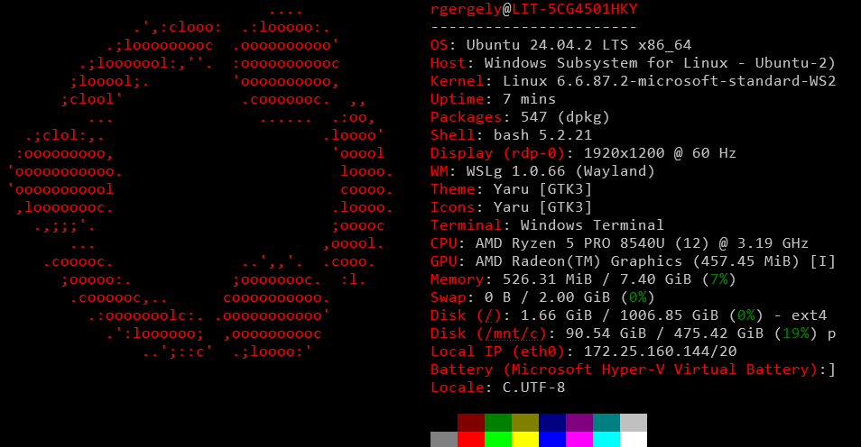

# Install Fastfetch on Ubuntu 24.04

## Install Fastfetch

Download tar.gz file from releases page of the Fastfetch repository:

```bash
wget -qO fastfetch.tar.gz https://github.com/fastfetch-cli/fastfetch/releases/latest/download/fastfetch-linux-amd64.tar.gz
```

Extract `fastfetch` file from `tar.gz` to `/usr/local/bin` directory:

```bash
sudo tar xf fastfetch.tar.gz --strip-components=3 -C /usr/local/bin fastfetch-linux-amd64/usr/bin/fastfetch
```

Now, fastfetch is available for all users as a system-wide command. We can check Fastfetch version as follows:

```bash
fastfetch --version
```
The `tar.gz` file is no longer needed, remove it:

```bash
rm -rf fastfetch.tar.gz
```
## Testing Fastfetch

Run fastfetch command without any arguments:

```bash
fastfetch
```
You'll receive system information.



## Uninstall Fastfetch

```bash
sudo rm -rf /usr/local/bin/fastfetch
```
